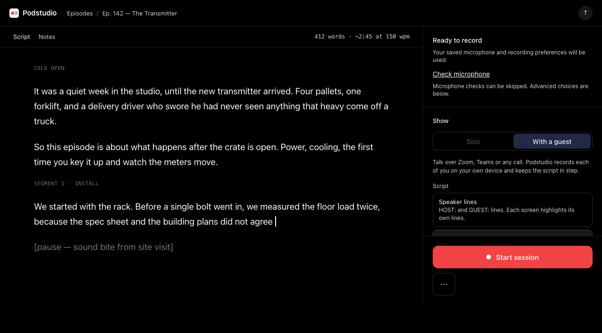
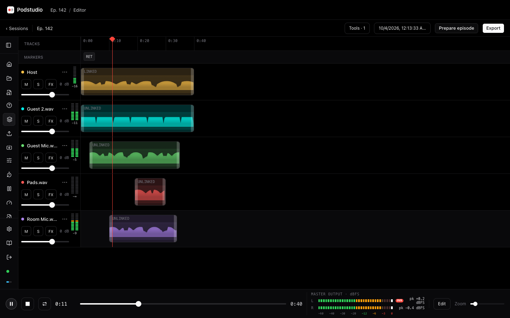
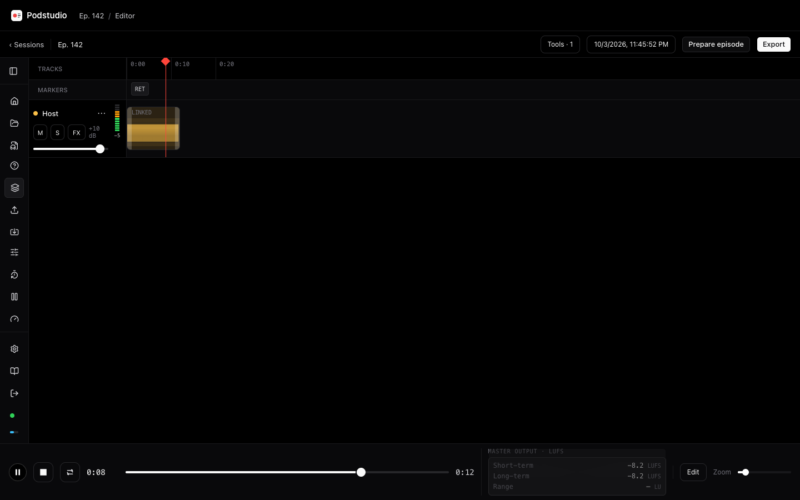
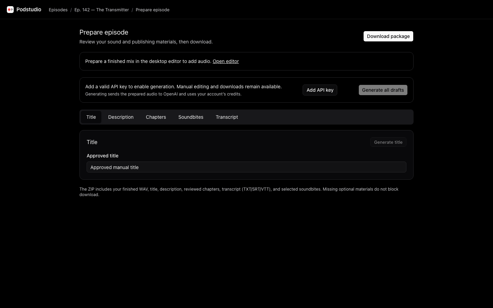
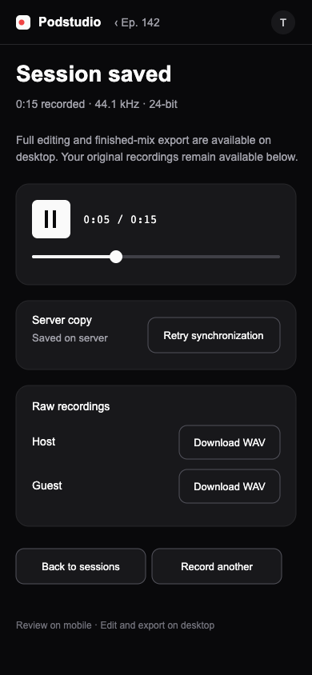

<p align="center">
  <picture>
    <source media="(prefers-color-scheme: dark)" srcset="docs/images/logo-dark.svg">
    
  </picture>
</p>

<p align="center">
  A free, self-hosted teleprompter, podcast recorder and editor.<br>
  Record lossless synchronized tracks, edit in the browser, and never lose the source audio.
</p>

<p align="center">
  
  
  
  
  <a href="LICENSE"></a>
</p>

<p align="center">
  <a href="#what-it-does">What it does</a> ·
  <a href="#where-it-stands">Where it stands</a> ·
  <a href="#try-it">Try it</a> ·
  <a href="#put-it-on-a-server">Deploy</a> ·
  <a href="#more-screens">Screens</a> ·
  <a href="docs/roadmap.md">Roadmap</a> ·
  <a href="#made-by">Made by</a>
</p>

> [!WARNING]
> **Podstudio is in active development and not yet released.** Expect rough
> edges, some screens with example data, and changes between versions.
> Recording, voice follow and exports work; testing on a real VPS is underway.
> Back up anything you record, and please open an issue if something breaks.

<p align="center">
  
</p>

## What it does

Podstudio records audio podcasts: solo, or with **one guest** and an optional
**producer**. Everyone talks on their usual call (Zoom, Teams…) while Podstudio
records each person losslessly on their own device, with the script kept in step.

| | |
|---|---|
| 🎙️ **Lossless recording** | Mono or stereo WAV at 16 or 24-bit, saved every 5 s and uploaded as you go |
| 📜 **A prompter that follows you** | Voice follow scrolls the script as you talk and holds your place when you ad-lib |
| ✂️ **Marked, not cut** | Retake, cough and ad-lib are one key each. The raw WAV stays whole; export keeps your last attempt of each line |
| 👥 **Guest and producer** | A 6-digit code and a waiting room. The guest records on their own device; the producer runs the script and session from anywhere |
| ⏱️ **Timecode and sync** | Tracks share a session clock. Export corrects drift and gaps between devices, and every WAV carries Broadcast WAV timecode |
| ✂️ **Podcast editor** | Synchronized waveforms, range editing, live dBFS meters, retake and pause review, linked edits, undo/redo, FX, autosave and a live preview of the whole mix |
| 📦 **A finished mix or raw tracks** | A mastered WAV, optional MP3, and optional aligned raw tracks. Finished mixes have no marker tones; host raw exports can |
| 🎛️ **Hotkey pads** | Nine sounds on the number keys, ducked under your voice and saved as their own track |
| 🧹 **Noise suppression** | One fader, like Waves NS1, using DeepFilterNet3 in the browser. The unprocessed files are always kept |
| 🔒 **Yours** | One small Node process with SQLite on your server, with two-factor sign-in. Recordings go only to your server (voice follow uses the browser's speech recognition) |

Also included:

- **Scripts:** paste text or import `.txt`/`.md`, then rename and reorder sections. Use speaker lines, a host-only script, talking points or ad-lib mode. **New episode** lets you record straight away or add a script first.
- **Mic check:** input, level, a ten-second test and noise, with Original / Cleaned / Removed previews.
- **Safeguards:** warnings for a stopped mic, clipping, battery and storage; offline upload retries; crash recovery.
- **Editing:** go straight from End session to the timeline. Select, move, split, trim and ripple-cut clips; set mute, solo, level and FX per track; import audio; remove a track from the mix and restore it later. Optional ten-band EQ, a full compressor, and custom LUFS and true-peak targets.
- **Recommended sound:** preview a gentle voice cleanup (−16 LUFS stereo or −19 LUFS mono, −1 dBTP ceiling) and apply it as one undoable edit.
- **Non-destructive projects:** source audio never changes. Edits, FX and export choices autosave as small project files, with a browser copy for offline work.
- **Long sessions:** playback streams in windows, so long recordings play without loading into memory.
- **Prepare episode:** optional OpenAI drafts of titles, description, chapters, transcript and soundbites from the finished mix, or write them yourself. Download the audio and approved text together. API keys are encrypted on the server; see the [episode preparation plan](docs/episode-preparation-plan.md).
- **Across devices:** recordings and account settings follow you to any browser; mic choice and text zoom stay on each device.
- **On a phone:** record and review with playback, sync retry and raw downloads. Full editing and export are desktop only.
- **Account security:** two-factor, recovery codes, trusted devices, password changes and a one-time admin setup link.

Every feature in detail: [docs/features.md](docs/features.md).

## More screens

<table>
  <tr>
    <td width="50%"></td>
    <td width="50%"></td>
  </tr>
  <tr>
    <td align="center"><sub><b>Editor</b>: waveforms, sidebar rail and live meters</sub></td>
    <td align="center"><sub><b>Master dock</b>: dBFS or loudness readings</sub></td>
  </tr>
  <tr>
    <td width="50%"></td>
    <td width="50%" align="center"></td>
  </tr>
  <tr>
    <td align="center"><sub><b>Prepare episode</b>: the finished mix and publishing package</sub></td>
    <td align="center"><sub><b>On a phone</b>: playback, sync status and raw downloads</sub></td>
  </tr>
</table>

Guests can join from a phone with the 6-digit code; their recording uploads as
they talk. iPhone and iPad recording needs iOS 17+ and hasn't yet been tested on
real devices. Android uses Chrome.

## Where it stands

| | |
|---|---|
| ✅ **Works now** | Solo recording with voice follow, markers and warnings · the desktop editor · WAV/MP3 and raw-track exports · guest and producer sessions with drift and gap correction · a mixer view on a laptop or phone · hotkey pads · two-factor accounts · server storage for episodes, scripts, recordings and projects · the guided installer |
| 🚧 **Validation underway** | Upgrades, iPhone recording and guest sessions on a real VPS, devices and networks |
| 🗓️ **Planned** | Versioned releases and tested upgrade paths, then calibration and deployment validation. See [docs/roadmap.md](docs/roadmap.md) |
| 🧪 **Example data for now** | The Domain & HTTPS checks and Controls remotes |

Known gaps: [docs/features.md#known-gaps](docs/features.md#known-gaps).

## Try it

You need Node 22.18 or later.

```sh
git clone https://github.com/thetylerwoodwardproject/podstudio && cd podstudio
npm install
npm run dev
```

Open **https://localhost:4321**, accept the self-signed certificate, then create
your account and turn on two-factor. To use a phone on the same Wi-Fi, open the
Network address printed in the terminal (`npm run dev:phone` does the same).

Podstudio runs in Chromium browsers (Chrome, Edge, Arc…) on computers and
Android, and in any browser on iOS 17+ (see [Browsers](docs/features.md#browsers)).

## Put it on a server

On a VPS (Debian 12 or Ubuntu 22.04+) with a domain pointing at it:

```sh
sudo ./deploy/install.sh
```

The installer:

1. checks the server and your domain's DNS;
2. sets up HTTPS with Caddy, or Nginx and Certbot (`--proxy nginx`);
3. offers a firewall and nightly backups;
4. checks HTTPS works;
5. prints a one-time link to create your admin account.

Run it again to upgrade; it backs up the database first. If you use AI drafts,
also back up `.ai-key` and `prepared/` ([details](docs/deploy.md#ai-credentials-prepared-audio-and-backups)).
Full guide: [docs/deploy.md](docs/deploy.md).

## Made by

<table>
  <tr>
    <td valign="middle">
      Podstudio is made by <b>Tyler Woodward</b>, host of the podcast <a href="https://tylerwoodward.me"><b>The Tyler Woodward Project</b></a>.
      <br><br>
      <a href="https://tylerwoodward.me"></a>
      <a href="https://www.facebook.com/thetylerwoodwardproject"></a>
      <a href="https://www.threads.net/@tylerwoodward.me"></a>
      <a href="https://www.instagram.com/tylerwoodward.me"></a>
    </td>
  </tr>
</table>

## For developers

The [Checks workflow](.github/workflows/checks.yml) runs the unit and server
tests, Astro and Svelte checks, the build and 14 Chromium browser tests on every
push and pull request ([browser test guide](tests/browser/README.md)).

- [docs/development.md](docs/development.md): commands, code layout and design screens
- [docs/ui-framework.md](docs/ui-framework.md): the UI framework every screen follows
- [docs/server-api.md](docs/server-api.md): the API for guests and producers
- [docs/roadmap.md](docs/roadmap.md): what's designed and coming next
- [docs/handoff.md](docs/handoff.md): current state, known issues and next steps
- [site/](site/README.md): the podstudio.dev landing page

## Credits

Built with [Astro](https://astro.build), [Svelte](https://svelte.dev) and
[Tailwind CSS](https://tailwindcss.com). The interface uses locally adapted
[shadcn-svelte](https://shadcn-svelte.com) components and
[Bits UI](https://www.bits-ui.com) controls. Audio-player controls, FX knobs,
status dots and step indicators are adapted from
[More Shadcn Svelte](https://github.com/kevwpl/more-shadcn-svelte) by kevwpl.
Save notifications use [svelte-sonner](https://github.com/wobsoriano/svelte-sonner)
by Robert Soriano. Icons are from [Lucide](https://lucide.dev), partly derived
from Feather by Cole Bemis. Noise suppression uses
[DeepFilterNet3](https://github.com/Rikorose/DeepFilterNet).

shadcn-svelte, Bits UI, More Shadcn Svelte and svelte-sonner are MIT-licensed;
Lucide is ISC, with MIT-licensed Feather portions. Licence notices are in
[`public/vendor/`](public/vendor/) and **Settings → About & credits**.

## Licence

MIT © 2026 [Tyler Woodward](https://tylerwoodward.me). See [LICENSE](LICENSE).
Bundled third-party work keeps its own licence: DeepFilterNet3 is MIT or
Apache-2.0, and Atkinson Hyperlegible is under the SIL Open Font License.
