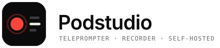
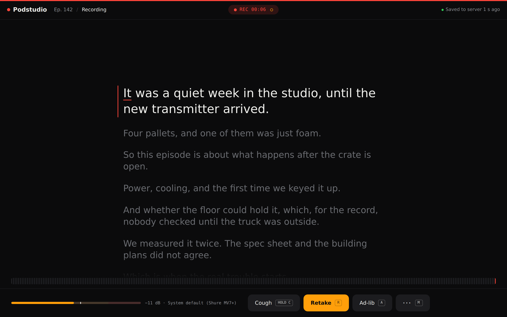
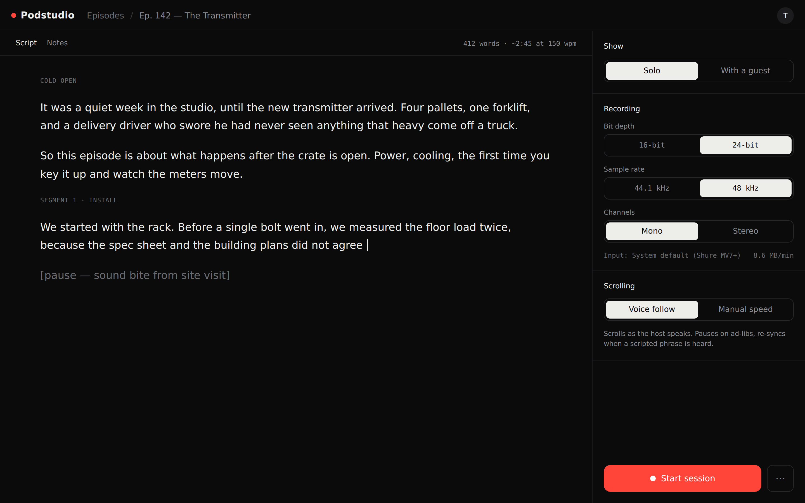
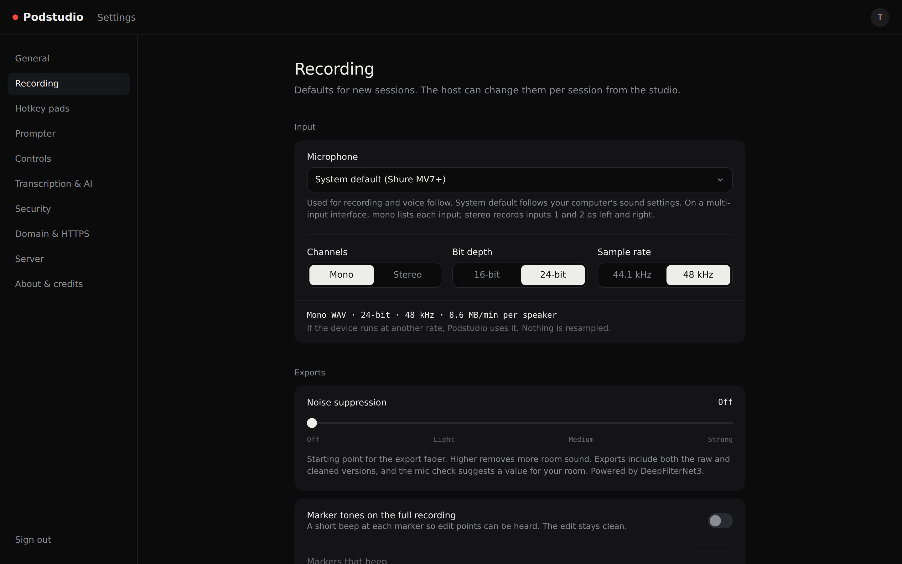
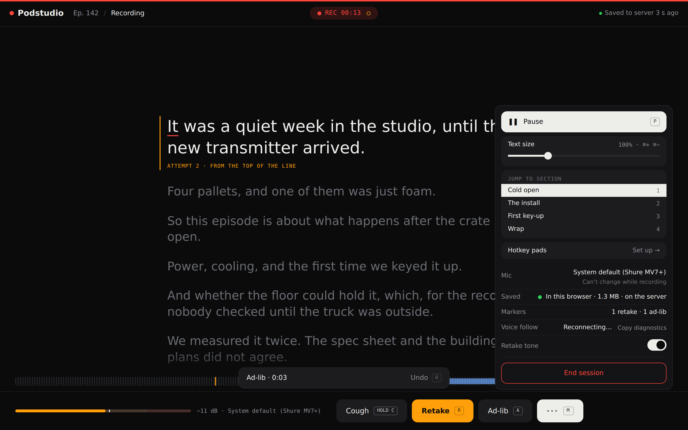
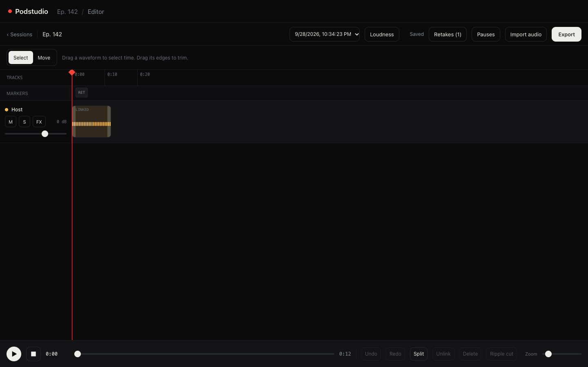
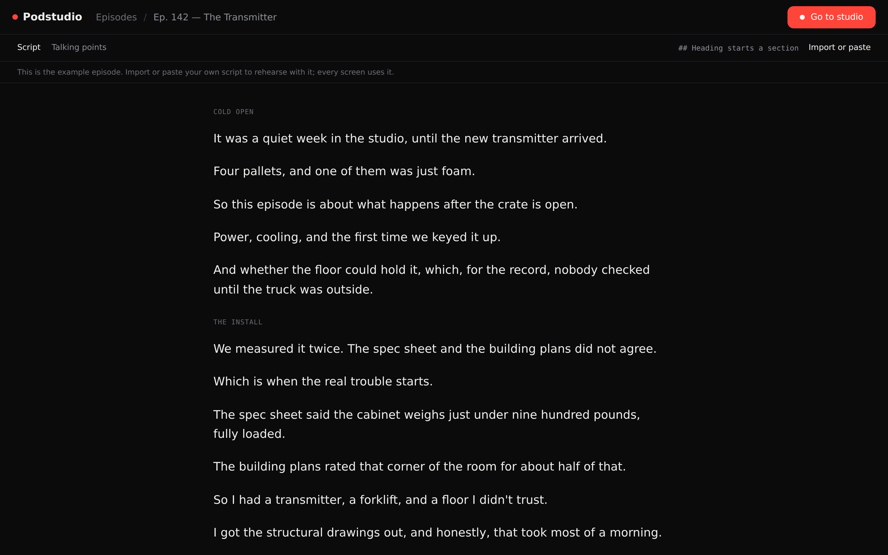
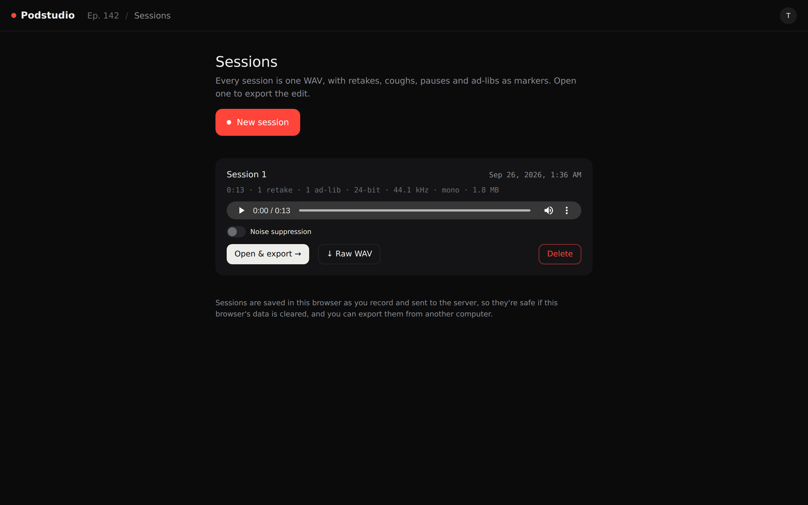
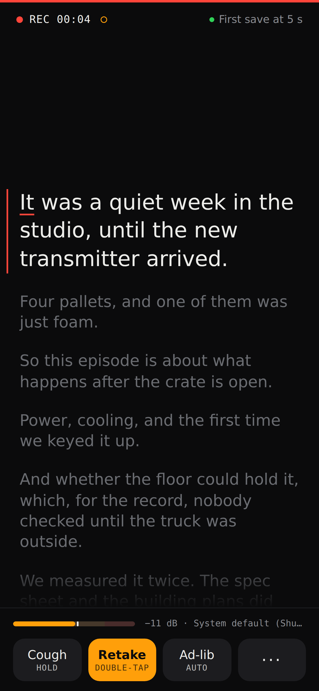
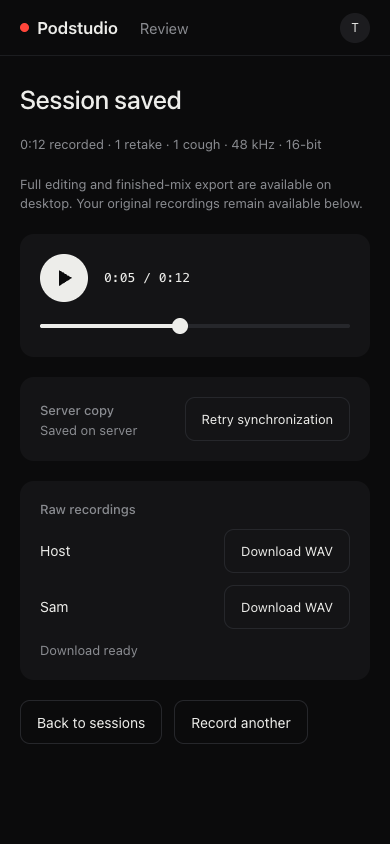

<p align="center">
  <picture>
    <source media="(prefers-color-scheme: dark)" srcset="docs/images/logo-dark.svg">
    
  </picture>
</p>

<p align="center">
  A free, self-hosted teleprompter, podcast recorder and lightweight editor.<br>
  Record lossless synchronized tracks, edit in the browser, and keep the source audio recoverable.
</p>

<p align="center">
  
  
  
  
  <a href="LICENSE"></a>
</p>

<p align="center">
  <a href="#what-it-does">What it does</a> ·
  <a href="#where-it-stands">Where it stands</a> ·
  <a href="#try-it">Try it</a> ·
  <a href="#put-it-on-a-server">Deploy</a> ·
  <a href="#more-screens">Screens</a> ·
  <a href="docs/roadmap.md">Roadmap</a> ·
  <a href="#made-by">Made by</a>
</p>

> [!WARNING]
> **Podstudio is in active development and changes often.** It isn't released
> yet: expect rough edges, screens that still show example data, and changes
> between versions. Recording, voice follow and exports work today; real-world
> testing on the first VPS install is underway. Keep your own backups of anything you
> record, and please open an issue if something breaks.

<p align="center">
  
</p>

<table>
  <tr>
    <td width="50%"></td>
    <td width="50%"></td>
  </tr>
  <tr>
    <td align="center"><sub>The studio: script, format and voice follow</sub></td>
    <td align="center"><sub>Recording settings: format, noise suppression, marker tones</sub></td>
  </tr>
</table>

## What it does

Podstudio is for audio podcasts. Record solo, or with **one guest** and an
optional **producer**: everyone talks on their usual call (Zoom, Teams…) and
Podstudio records each person on their own device, losslessly, with the script
kept in step.

| | |
|---|---|
| 🎙️ **Lossless recording** | Mono or stereo lossless WAV at 16 or 24-bit, saved every 5 s and sent to your server as you go |
| 📜 **A prompter that follows you** | Voice follow scrolls the script as you talk and holds your place when you ad-lib |
| ✂️ **Marked, not cut** | Retake, cough and ad-lib are one key each. The raw WAV stays whole; the export adds an edit that keeps your last attempt of each line |
| 👥 **Guest and producer** | A 6-digit code and a waiting room. The guest records on their own device; the producer runs the script and the session from anywhere |
| ⏱️ **Timecode and sync** | Every track logs sync points on a shared session clock. Export corrects drift and gaps between devices, and every WAV carries Broadcast WAV timecode for your editor |
| ✂️ **Podcast editor** | A desktop timeline with synchronized waveforms, range editing and a right-click menu, live track and stereo master dBFS meters, retake and pause review, linked edits, undo/redo, podcast FX, autosave, and a continuous cumulative preview |
| 📦 **A finished mix or raw tracks** | Export a mastered WAV, optional MP3, and optional aligned host, guest, pads and imported raw tracks. Finished mixes contain the edits and no marker tones; host raw exports can carry configured marker tones |
| 🎛️ **Hotkey pads** | Nine sounds on the number keys, configured in a desktop sheet from uploads, previous sessions or the library, previewed live, ducked under your voice and saved as their own track |
| 🧹 **Noise suppression** | One fader, like Waves NS1, using DeepFilterNet3 in the browser. The unprocessed files are always kept |
| 🔒 **Yours** | One small Node process with SQLite on your own server, with two-factor sign-in. Recordings go only to your server (voice follow uses the browser's speech recognition) |

The recording workflow also includes:

- **Script import and editing:** paste text or import `.txt`/`.md`, rename and
  reorder sections, then review before importing. Use speaker lines, a host-only
  script, talking points, or ad-lib mode.
- **Mic check:** Input → Level → Test → Noise, with a ten-second recording,
  device and channel selection, and Original / Cleaned / Removed previews.
- **Recording safeguards:** mic-stop, clipping, battery and storage warnings,
  offline upload retries, crash recovery, and voice-follow diagnostics.
- **Direct editor access:** Open editor from a recorded episode or its sessions, with the latest completed session selected and a switcher for older sessions. Server recordings also open on a new computer.
- **Advanced audio, when needed:** optional ten-band EQ, compressor threshold/ratio/knee/makeup/attack/release, draft FX preview and bypass, plus custom LUFS and true-peak targets with whole-mix analysis and mastered playback.
- **Audio imports:** a lower-corner status card shows read, conversion, upload and server-confirmation progress. Failed uploads retain the file and offer a same-ID retry without duplicate tracks.
- **Editor after recording:** desktop users go straight from End Session to a synchronized timeline. Waveforms are prepared from bounded audio reads even when a recording has no saved peak data. Click a clip to select it, drag it to move, or Shift-drag to select time; split, trim, delete or ripple-cut clips; review retakes and long-pause suggestions; use Mute, Solo, Level and a focused FX sheet per track; import browser-decodable audio; and undo or redo edits. Secondary actions live in compact menus. Remove a track from the finished mix and restore it later without deleting its source audio. Phones use a simplified recording review with scrubbing, synchronization status/retry, and individual raw downloads; full editing/export is available on desktop.
- **Non-destructive projects:** source WAV and PCM segments never change. Clip boundaries, link groups, markers, FX, track levels and export choices autosave as compact, revisioned project metadata, with a browser recovery copy for offline work.
- **One cumulative preview:** playback always reflects the current edits, gain, mute and FX. It starts from a short browser-rendered window, then prefetches larger bounded windows, so long sessions play without loading the whole recording into memory. The master meter switches between dBFS peaks and live short-term, long-term and range loudness readings.
- **Consistent controls:** interactive checkboxes use shadcn-svelte, while one-time codes for sign-in, setup, and joining a session support paste and device autofill.
- **Simple export:** a compact sheet always includes the finished WAV and can add MP3 and aligned raw tracks. Completion shows Back to sessions and Download again; Optional AI tools is reserved for a later release.
- **Sessions and settings across devices:** recordings upload as you go and
  can be brought into another browser to play or export. Recording, export and
  prompter settings follow your account; microphone selection stays on the
  device, as does the recording screen’s text zoom. Settings show whether each
  server write is saving, saved, waiting for a connection or failed. Sessions can be played,
  downloaded or deleted.
- **Account security:** two-factor authentication, recovery codes, trusted
  devices and password changes, plus a one-time admin setup link on the server.

Every feature in detail: [docs/features.md](docs/features.md).

## More screens

<table>
  <tr>
    <td width="50%"></td>
    <td width="50%"></td>
  </tr>
  <tr>
    <td align="center"><sub><b>More</b>: pause, text size, jump to a section, the mic and what's saved</sub></td>
    <td align="center"><sub><b>Editor</b>: synchronized tracks, quiet markers and one cumulative preview</sub></td>
  </tr>
  <tr>
    <td width="50%"></td>
    <td width="50%"></td>
  </tr>
  <tr>
    <td align="center"><sub><b>Script</b>: paste or import, sections from <code>## headings</code></sub></td>
    <td align="center"><sub><b>Sessions</b>: every take, with its markers, ready to play or export</sub></td>
  </tr>
</table>

<table>
  <tr>
    <td width="34%" align="center"></td>
    <td width="66%" valign="middle">
      <h3>On a phone, too</h3>
      <p>The same control bar works on a phone: Cough, Retake and Ad-lib under your thumb, the level meter above them, and the script taking the rest of the screen. iPhone and iPad recording uses the AudioWorklet path on supported iOS 17+ browsers; real-device validation is still pending. Android uses Chrome.</p>
      <p>A guest can join from their phone with a 6-digit code, and the recording they make there is uploaded to your server as they talk.</p>
      
      <p><sub><b>Session saved</b>: playable recording, marker count, server synchronization and individual raw downloads</sub></p>
    </td>
  </tr>
</table>

## Where it stands

| | |
|---|---|
| ✅ **Works now** | Solo recording with voice follow, markers and warnings · a desktop, non-destructive podcast editor with synchronized tracks, retake and pause review, linked editing, imports, per-track FX, autosave and undo/redo · finished WAV/MP3 and optional aligned raw-track exports · guest and producer sessions with drift and gap correction · a mixer view on a laptop or phone · desktop hotkey pads · accounts with two-factor · episodes, scripts, recordings and editor projects stored on the server · the guided installer |
| 🚧 **Validation underway** | The first real VPS is installed for real-world testing · checking upgrades, iPhone recording and guest sessions on real devices and networks |
| 🗓️ **Planned** | Versioned releases and tested upgrade paths, then further work including calibration and transcription. See [docs/roadmap.md](docs/roadmap.md) |
| 🧪 **Example data for now** | Transcripts, titles, chapters and soundbites (the episode package), the Domain & HTTPS checks, the Controls remotes |

Known gaps and caveats: [docs/features.md#known-gaps](docs/features.md#known-gaps).

## Try it

You need Node 22.18 or later.

```sh
git clone https://github.com/thetylerwoodwardproject/podstudio && cd podstudio
npm install
npm run dev
```

Open **https://localhost:4321** (accept the self-signed certificate once), then
create your account and turn on two-factor. The current dev configuration
listens on the network too; use the Network address printed in the terminal for phones on your Wi-Fi. `npm run dev:phone`
explicitly enables the same network access.

It runs in Chrome, Edge, Arc and other Chromium browsers on computers and
Android, and in any browser on iPhone and iPad with iOS 17 or later (see
[Browsers](docs/features.md#browsers)).

## Put it on a server

On a VPS (Debian 12 or Ubuntu 22.04+) with a domain pointing at it:

```sh
sudo ./deploy/install.sh
```

The installer walks you through everything:

1. checks the server;
2. checks your domain's DNS;
3. sets up HTTPS, with Caddy by default or Nginx and Certbot if you choose (`--proxy nginx`);
4. offers the firewall and nightly backups;
5. checks HTTPS works;
6. prints a one-time link to create your admin account.

Run it again to upgrade; it backs up the database first. The first lab VPS is
installed; fresh installs, upgrades and server memory use are now being validated there. The full
guide is [docs/deploy.md](docs/deploy.md).

## Made by

<table>
  <tr>
    <td valign="middle">
      Podstudio is made by <b>Tyler Woodward</b>, host of the podcast <a href="https://tylerwoodward.me"><b>The Tyler Woodward Project</b></a>.
      <br><br>
      <a href="https://tylerwoodward.me"></a>
      <a href="https://www.facebook.com/thetylerwoodwardproject"></a>
      <a href="https://www.threads.net/@tylerwoodward.me"></a>
      <a href="https://www.instagram.com/tylerwoodward.me"></a>
    </td>
  </tr>
</table>

## For developers

The [Checks workflow](.github/workflows/checks.yml) runs unit/server tests,
Astro and Svelte checks, the build, and all 14 Chromium browser tests on pushes
and pull requests. Browser failure logs and screenshots are retained for seven
days; see [the browser test guide](tests/browser/README.md).

- [docs/development.md](docs/development.md): commands, the code layout, and where each design screen lives
- [docs/ui-framework.md](docs/ui-framework.md): the UI framework every screen follows
- [docs/server-api.md](docs/server-api.md): the API for guests and producers
- [docs/roadmap.md](docs/roadmap.md): what's designed and coming next
- [docs/handoff.md](docs/handoff.md): where the project is now, known issues, and the next steps
- [site/](site/README.md): the podstudio.dev landing page

## Credits

Podstudio is built with [Astro](https://astro.build),
[Svelte](https://svelte.dev), and [Tailwind CSS](https://tailwindcss.com).
The interface uses locally adapted [shadcn-svelte](https://shadcn-svelte.com)
components and [Bits UI](https://www.bits-ui.com) controls. Its audio-player
controls, FX knobs, status dots, and step indicators are adapted from
[More Shadcn Svelte](https://github.com/kevwpl/more-shadcn-svelte) by kevwpl.
Top save notifications use [svelte-sonner](https://github.com/wobsoriano/svelte-sonner)
by Robert Soriano. Icons are from [Lucide](https://lucide.dev), including portions
derived from Feather by Cole Bemis. Noise suppression uses
[DeepFilterNet3](https://github.com/Rikorose/DeepFilterNet).

shadcn-svelte, Bits UI, More Shadcn Svelte, and svelte-sonner are MIT-licensed. Lucide uses
the ISC license, with MIT-licensed Feather portions. The copied component
license notices are in [`public/vendor/`](public/vendor/); the full list of
bundled work and licenses is also in **Settings → About & credits**.

## Licence

MIT © 2026 [Tyler Woodward](https://tylerwoodward.me). See [LICENSE](LICENSE).
Bundled third-party work keeps its own licence: DeepFilterNet3 is MIT or
Apache-2.0, and Atkinson Hyperlegible is under the SIL Open Font License.
